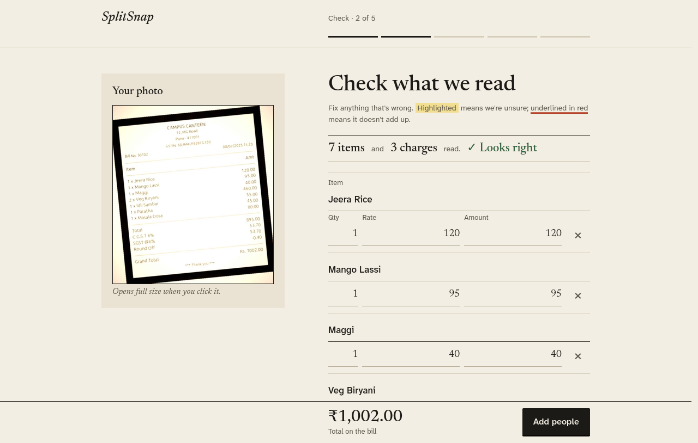
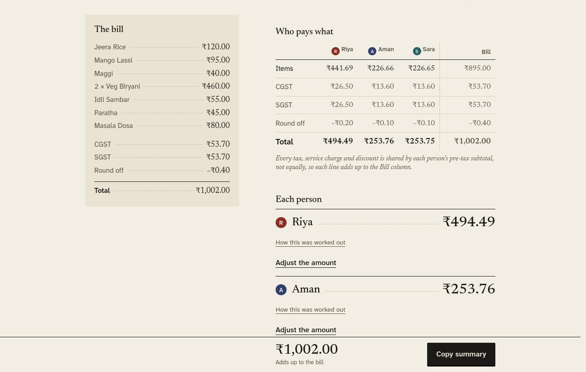
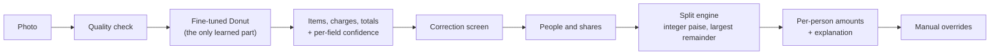

# SplitSnap

**Photograph a restaurant bill, fix what was misread, and split it exactly.**
SplitSnap reads the items and charges from one photo with a Donut model we fine-tuned ourselves, then divides the bill among named people. Every tax, service charge, packaging fee, discount and rounding line is shared in proportion to what each person ordered, in exact paise, and every person gets a written account of how their amount was reached.

Built for the Nalafaad Hackathon, Track 1 (see [`docs/problem_statement.txt`](docs/problem_statement.txt)). Everything in the extraction pipeline is open source and runs locally; no closed or paid API is called.

<p align="center">
  
  
</p>

| Quick links | |
|---|---|
| Model report (PDF) | [`report/SplitSnap_Model_Report.pdf`](report/SplitSnap_Model_Report.pdf) |
| Three processed sample bills | [`examples/processed_bills/`](examples/processed_bills/) |
| Measured results (raw JSON and logs) | [`results/`](results/) |
| Documentation index | [`docs/README.md`](docs/README.md) |

---

## Contents

1. [What it does](#what-it-does)
2. [Results at a glance](#results-at-a-glance)
3. [How it works](#how-it-works)
4. [Quick start](#quick-start)
5. [The model checkpoint](#the-model-checkpoint)
6. [Web app and API](#web-app-and-api)
7. [Training and reproducing the results](#training-and-reproducing-the-results)
8. [Robustness and confidence](#robustness-and-confidence)
9. [Performance and serving capacity](#performance-and-serving-capacity)
10. [Repository layout](#repository-layout)
11. [Limitations and future work](#limitations-and-future-work)
12. [Open-source compliance and data](#open-source-compliance-and-data)

---

## What it does

A five-step, mobile-first web app:

| Step | What happens |
|---|---|
| 1. Photo | Take or upload a photo. Poor photos (blurred, dark, washed out, too small) get a retake prompt before reading. Ten example photos are built in. |
| 2. Check | Every item, quantity, rate, amount and charge is editable. Fields the model is unsure about are highlighted; lines whose arithmetic does not add up are underlined in red, with a one-tap fix for a misread rate. On wide screens the photo stays beside the fields. |
| 3. People | Add any number of named people, now or later. |
| 4. Who had what | Tap who shared each item; give someone more than one share; split equally in one tap. |
| 5. Split | Exact amounts, a table of every charge divided per person, a plain-language explanation for each person, manual overrides stamped as such, and a JSON export in the problem statement's schema. |

How it covers the requirements:

| | Requirement | Where |
|---|---|---|
| R1 | Self fine-tuned extraction model | Donut fine-tuned on CORD, SROIE and generated Indian-style bills ([`splitsnap/train.py`](splitsnap/train.py), [`kaggle/run_kaggle.py`](kaggle/run_kaggle.py)); before/after in the [report](report/SplitSnap_Model_Report.pdf) |
| R2 | Confidence scores (bonus) | Per-field confidence from token probabilities, calibrated; lowest-scoring 8% highlighted ([`docs/CALIBRATION.md`](docs/CALIBRATION.md)) |
| R3 | Correction UI | Step 2; corrections feed the split |
| R4 | Open source only | [`docs/OPEN_SOURCE.md`](docs/OPEN_SOURCE.md) |
| R5 | Charges identified and shown separately | Eleven charge types; per-person charge table on step 5 |
| R6 | Explained splitting | [`splitsnap/explain.py`](splitsnap/explain.py); see [`examples/processed_bills/`](examples/processed_bills/) |
| R7 | Override | Step 5: any person's amount, flagged as a manual adjustment, with optional rebalancing |
| R8 | Party size and names | Any number of named people, editable at any step |

## Results at a glance

All numbers are measured; the table says on what. Metrics are our own implementation ([`splitsnap/metrics.py`](splitsnap/metrics.py), [`splitsnap/metrics_sroie.py`](splitsnap/metrics_sroie.py)).

| Test set | n | Result |
|---|---|---|
| CORD test (held out) | 95 | TED 0.930; field F1 0.894; item F1 0.876; charge F1 0.800; grand total correct 94.7% |
| SROIE test (held out) | 347 | exact match: company 85.3%, date 95.1%, address 78.4%, total 87.3%; micro F1 0.872 |
| Generated Indian-style bills (held-out test split) | 100 | TED 0.997; field F1 0.985; charge F1 0.972 |
| **Real photographed Indian bills** | **0** | **not measured: none were available (see [limitations](#limitations-and-future-work))** |

**Before and after fine-tuning** on 30 further generated bills that were never used for training, validation, testing or model selection ([`results/before_after.json`](results/before_after.json)):

| | TED | Field F1 | Item F1 | Charge F1 | Grand total correct |
|---|---|---|---|---|---|
| `donut-base`, pretrained only, not fine-tuned | 0.065 | 0.000 | 0.000 | 0.000 | 0 of 30 |
| Fine-tuned (ours) | 0.998 | 0.988 | 1.000 | 0.964 | 30 of 30 |

The pretrained model writes the start token and then the end token: it has never seen our output format. These are generated bills, so this shows that training works, not how the model reads real bills.

Speed: median **0.455 s per bill on a Kaggle T4** (542 test bills, fp16); about 0.27 s on a laptop RTX 4050. Model: 202 M parameters, 411 MB in fp16.

## How it works



**Perception is learned, arithmetic is exact.** The model reads the photo into a structured bill. Everything after that is deterministic code ([`splitsnap/split_engine.py`](splitsnap/split_engine.py)): items are divided by share units; every non-item line is divided in proportion to each person's pre-tax subtotal with largest-remainder rounding, so the parts always add up to the line exactly. A mistake in the final amounts therefore traces back to a visible, editable field.

**The model.** `naver-clova-ix/donut-base` (OCR-free Swin encoder and BART-style decoder), fully fine-tuned at 1280×960 in fp16 for 16 epochs on CORD, SROIE (as a second task behind its own start token) and generated Indian-style bills, with per-source augmentation. Checkpoint chosen on validation bills only. Details, curves and splits are in the [report](report/SplitSnap_Model_Report.pdf).

## Quick start

Needs Python 3.10+; a CUDA GPU is optional (CPU works, slowly).

```bash
git clone https://github.com/atrijopal/naala_ml_tharki_ap.git
cd naala_ml_tharki_ap
python -m venv .venv && source .venv/bin/activate
pip install -r requirements.txt            # pick the torch build for your CUDA from pytorch.org if needed
```

**Without a model** (two built-in sample bills, the whole flow works):

```bash
make demo            # or: DEMO=1 uvicorn splitsnap.app:app --port 8000
```

**With the real model** (put the checkpoint in `ckpt/best_fp16/` first, see below):

```bash
make app             # or: CKPT=ckpt/best_fp16 PRELOAD=1 uvicorn splitsnap.app:app --port 8000
```

Open <http://localhost:8000>, tap "Try a sample" or "Or try an example photo", or take a photo. On a phone, open the same address over your network (`--host 0.0.0.0`).

Run the tests:

```bash
make test            # unit, property and endpoint tests; no GPU needed
make e2e             # drives the whole flow in headless Firefox (needs the app on :8765, see tests/e2e_ui.py)
```

## The model checkpoint

The weights are 411 MB (fp16), above GitHub's file limit, so they are **not stored in git**. The app expects the standard Hugging Face layout in `ckpt/best_fp16/`:

```
config.json  generation_config.json  model.safetensors  preprocessor_config.json
sentencepiece.bpe.model  tokenizer.json  tokenizer_config.json  special_tokens_map.json  added_tokens.json
```

Load it in code with [`splitsnap.model.load_model`](splitsnap/model.py):

```python
from splitsnap.model import load_model
model, processor = load_model("ckpt/best_fp16")
```

To rebuild it from the training run, fetch the Kaggle output of the second training session and export it in half precision:

```bash
kaggle kernels output <you>/splitsnap-full-b -p ckpt/b2          # the kernel output includes runs/run1/best
python scripts/export_fp16.py --ckpt ckpt/b2/runs/run1/best --out ckpt/best_fp16
```

Or fine-tune your own from scratch with the commands below.

## Web app and API

FastAPI backend ([`splitsnap/app.py`](splitsnap/app.py)), plain JavaScript front end ([`splitsnap/static/`](splitsnap/static/)), no external CDN: fonts are self-hosted.

| Method and path | Purpose |
|---|---|
| `GET /` | the app |
| `GET /health` | model loaded?, flag threshold, charge types |
| `POST /extract` | photo in, bill + per-field confidences + arithmetic issues + photo-quality report out |
| `POST /validate` | live arithmetic check and charge summary after each edit |
| `POST /split` | bill, people, assignments (share units), optional overrides in; amounts, explanation out |
| `POST /export` | corrected bill in the problem statement's JSON schema |
| `GET /demo`, `GET /examples` | built-in sample bills and example photos |

Configuration by environment variable:

| Variable | Default | Meaning |
|---|---|---|
| `CKPT` | (none) | checkpoint directory; without it photo reading is off |
| `DEMO` | `0` | `1` serves two built-in sample bills and needs no model |
| `PRELOAD` | `0` | `1` loads and warms up the model at start-up so the first user does not wait |
| `FAST_PREP` | `0` | `1` decodes large JPEGs at reduced size (faster; see [`docs/INFERENCE_REPORT.md`](docs/INFERENCE_REPORT.md) for the risk) |
| `CONF_THRESHOLD` | from `results/calibration.json` | confidence below which a field is highlighted |
| `CACHE_MAX` | `1000` | results kept for repeated uploads |
| `AUTO_DESKEW_DEG` | `6` | photos tilted by at least this many degrees are straightened before reading; `0` turns it off |

The model runs in a worker thread with a lock, so one bill is on the GPU at a time and edits, splits and page loads from other users are never blocked behind it.

If a photo yields no items (the main task is weak on retail-style scans, see below), the app uses the receipt-header task to read the shop name and total and offers to enter the items by hand with the total filled in.

## Training and reproducing the results

Training runs on Kaggle (free T4); the laptop is used only for inference and the studies below. You need a Kaggle account with a token in `~/.kaggle/` and the CLI (`pip install -r requirements-dev.txt`). Kaggle usernames and kernel names in the scripts belong to the original authors; change `atrijopal` to yours.

```bash
bash scripts/kaggle_push_code.sh                       # upload the splitsnap/ package as a private dataset
CHUNK=8 bash scripts/kaggle_run.sh full a              # overfit gate, then epochs 1-8 (about 2.2 h)
CHUNK=8 RESUME_KERNEL=<you>/splitsnap-full-a bash scripts/kaggle_run.sh full b   # epochs 9-16
RESUME_KERNEL=<you>/splitsnap-full-b bash scripts/kaggle_run.sh eval              # held-out evaluation
bash scripts/kaggle_fetch.sh splitsnap-eval            # download results and logs
```

| Setting | Value |
|---|---|
| Initialisation | `naver-clova-ix/donut-base` plus our tokens |
| Data per epoch | CORD 769, SROIE 558, generated bills 700 (2,027 samples) |
| Input / target | 1280×960; up to 512 tokens |
| Optimiser | AdamW (fused), lr 3e-5, cosine, 10% warm-up |
| Batch | 1 × 8 gradient accumulation |
| Precision | fp16 mixed, fp32 master weights |
| Speed | 0.42 s per sample, about 14 min per epoch, 7.8 GB peak on a T4 |
| Epochs / time | 16, two sessions of 126 and 119 min |

The training logs behind every curve are in [`results/training_logs/`](results/training_logs/).

**Local studies** (need the checkpoint; results are written to `results/`):

```bash
python scripts/before_after.py       --ckpt ckpt/best_fp16 --n 30   # not fine-tuned vs fine-tuned
python scripts/degradation_study.py  --ckpt ckpt/best_fp16          # blur, tilt, fading; confidence under degradation
python scripts/error_analysis.py     --ckpt ckpt/best_fp16          # what kinds of mistakes
python scripts/repair_check.py       --ckpt ckpt/best_fp16          # the one-tap rate fix
python scripts/sroie_scan_check.py   --ckpt ckpt/best_fp16          # real SROIE scans through the main task
python scripts/load_test.py                                         # concurrent uploads (app running)
make report                                                         # rebuild report/SplitSnap_Model_Report.pdf (needs tectonic)
```

The report's SROIE figures use dataset images that are not redistributed; rebuild them with `python scripts/make_examples.py` (see [`examples/README.md`](examples/README.md)).

## Robustness and confidence

**Calibrated confidence.** A field's score is the lowest probability among the tokens that wrote it. On 4,107 fields from 198 validation bills it separates wrong from right fields with AUROC 0.888 and is well calibrated (expected calibration error 0.012, 0.005 after isotonic calibration). The app highlights the lowest-scoring 8%, which catches 68% of real errors there. Full analysis: [`docs/CALIBRATION.md`](docs/CALIBRATION.md).

**Degraded photos.** The 100 unseen generated bills were degraded in controlled steps and read again ([`results/degradation.json`](results/degradation.json); generated bills only, not real photos). "Errors caught" is the share of wrong fields that the confidence flag highlights.

| Condition | Field F1 | Grand total correct | Errors caught by flags | Fields highlighted | App asks for a retake |
|---|---|---|---|---|---|
| Clean | 0.988 | 100% | 93% | 5.5% | 13% |
| Blur 1.5 px | 0.987 | 100% | 93% | 5.5% | 95% |
| Blur 3 px | 0.943 | 84% | 96% | 25% | 100% |
| Blur 5 px | 0.082 | 0% | 99% | 97% | 100% |
| Tilt 4° | 0.984 | 99% | 92% | 5.4% | 5% |
| Tilt 8° | 0.978 | 100% | 76% | 7.4% | 5% |
| Tilt 15° | 0.911 | 98% | 68% | 17% | 5% |
| Faded to 60% / 40% / 25% contrast | 0.988 / 0.986 / 0.984 | 100% | 93% / 94% / 90% | 5.6% / 5.9% / 6.5% | 33% / 68% / 100% |

What this shows, honestly:

- Blur and fading are handled well: accuracy holds until blur is heavy, and the flags point at nearly all the errors. When reading fails outright (blur 5 px) almost every field is highlighted, so the user is not misled.
- **Tilt is the weak spot.** At 15° a third of bills contain an error that no flag points at, and the retake prompt does not look at tilt. Straightening tilted photos before reading helps a lot, so the app now does it for photos tilted by 6° or more (`AUTO_DESKEW_DEG`): field F1 at 8° goes from 0.978 to 0.985 and at 15° from 0.911 to 0.971 (item F1 0.72 to 0.93; [`results/deskew_check.json`](results/deskew_check.json)). It costs 0.3 points on untilted bills, hence the threshold, about 30 ms per photo, and the angle estimator stops at 10°, so 15° is only partly corrected. Generated bills only; on real CORD photos an earlier test found straightening neutral at small angles.
- **The retake prompt is over-cautious** on these generated bills: it fires on 95% of lightly blurred and 100% of strongly faded bills that the model still reads correctly. It is only a prompt ("Use it anyway" continues), and its thresholds were calibrated on CORD and SROIE photos, not retuned here.

**Mistakes on clean bills** ([`results/error_analysis.json`](results/error_analysis.json)): of 27 wrong fields on the 100 unseen bills, 26 are a misread rate (unit price) with the line total correct, and 1 is a wrong charge type. Because quantity × rate must equal the line total, the validator suggests "line total ÷ quantity" as a one-tap fix. On these bills the suggestion fixes all 26 and breaks none (field F1 0.988 to 0.997; bills with every rate right 80 to 100 of 100; [`results/repair_check.json`](results/repair_check.json)). It is a suggestion the user taps, never applied silently, and it has only been measured on generated bills.

**Real receipt scans: a known failure.** SROIE scans carry only four labels, so the main (items and charges) task was never trained on that kind of image. Tested on 8 real SROIE scans ([`results/sroie_scan_check.json`](results/sroie_scan_check.json)): the main task returned **no items on any of them**, with or without any of six image enhancements; the model writes the four SROIE fields instead. An ad-hoc run on 28 photo-style composites of the same scans (not saved) gave the same result. The auxiliary task reads those scans well (date 8 of 8, company 7, total 7, address 4 exact), which the app now uses to offer the shop name and total when no items are found. A proper fix needs training the main task on real receipt-style data (see future work).

## Performance and serving capacity

Measured on a laptop RTX 4050, one bill at a time ([`docs/INFERENCE_REPORT.md`](docs/INFERENCE_REPORT.md), [`results/`](results/)):

| Change | Effect | Status |
|---|---|---|
| fp16 instead of fp32 | median 538 to 285 ms; memory 1.43 to 0.72 GB; identical answers on 20 of 20 images | in use |
| Load and warm up at start-up | removes a 380 ms penalty on the first request | in use |
| fp16 checkpoint file | 809 MB to 411 MB | in use |
| Cheaper JPEG decode for big photos | 12 MP photo 426 to 261 ms; one field in about 120 changed | opt-in (`FAST_PREP=1`) |
| `torch.compile` on the encoder | 437 to 373 ms on 4 bills, identical output | not enabled |
| int8 and FP8 quantisation, compiled decoder | slower and/or changed answers | rejected |

**Capacity.** Concurrent uploads of unique photos to one laptop GPU ([`results/load_test.json`](results/load_test.json)): throughput stays at about **2.8 bills per second** at any concurrency, the wait grows with the queue (median 0.33 s alone, 2.83 s with eight users at once), and bill validation stayed under 14 ms throughout. Capacity therefore scales by adding GPUs. Rough sizing, as arithmetic on the measured latency and not a deployed test (0.5 s of GPU per bill, peak three times the hourly average, 60% target utilisation):

| Bills read per hour | Peak bills per s | T4-class GPUs |
|---|---|---|
| 100 | 0.08 | 1 |
| 1,000 | 0.83 | 1 |
| 10,000 | 8.3 | 7 |
| 100,000 | 83 | 70 |

A model copy needs about 0.72 GB of GPU memory and preparation costs 55 ms of CPU per bill, so GPU time is the limit. Batching and CPU-only serving are untested.

## Repository layout

```
splitsnap/            the Python package
  app.py  static/       web app: FastAPI backend and the five-step front end
  train.py runguard.py  fine-tuning loop and its safety guards (NaN, hang, stalled-run checks)
  model.py infer.py     build/load the model; generation with per-field confidences
  dataset.py augment.py synth.py   data pipeline, per-source augmentation, Indian-style bill generator
  convert_cord.py convert_sroie.py build_manifest.py valsplit.py   data conversion and splits
  split_engine.py explain.py validate.py   exact split, explanations, arithmetic checks
  metrics.py metrics_sroie.py confidence.py calibrate.py evaluate.py   evaluation and R2
kaggle/               the kernel entry point that runs every training and evaluation stage
scripts/              Kaggle helpers, benchmarks, the studies above, report data, screenshots
tests/                unit, property and endpoint tests; browser end-to-end test
examples/             generated example bills, 100 unseen bills, three processed sample bills
results/              measured results (JSON) and training logs behind every number
report/               LaTeX source and PDF of the model report
docs/                 documentation index, results, calibration, inference and open-source notes
```

## Limitations and future work

- **No real Indian bills.** Indian-style behaviour is measured on generated bills only; real bills are the largest gap in the evidence. Next step: collect and label 30 to 50 photographed bills and report held-out scores on them.
- **The main task does not read SROIE-style retail scans** (above). Future work: train the main task on real receipt-style data, or constrain decoding to the main schema.
- **Tilt and the retake prompt.** Extend the straightening estimator beyond 10°, check it on real photos, and retune the retake thresholds (they were set on CORD and SROIE photos and are over-cautious on our generated bills).
- **Running on a phone.** The fp16 model is 411 MB. Options: export the encoder and decoder to a mobile runtime (ONNX Runtime Mobile, Core ML, TensorFlow Lite), distil into a smaller model, lower the input resolution after measuring the accuracy cost, or capture on the phone and read on a server. Our int8 and FP8 tests ran in eager PyTorch on a desktop GPU and do not predict mobile behaviour.
- **Faster serving.** TensorRT or ONNX export of the encoder, a static key-value cache for the decoder, batching.
- **Harder bills.** Hindi and other scripts, handwritten totals, bills longer than one photo, a fine-tuned vision-language model as a challenger (none was fine-tuned, so no accuracy claim is made against them).
- **Product.** No sign-in, persistence, rate limiting or payment links; one GPU worker per process.
- **Evaluation caveats.** Metrics are our own implementation. Near-duplicate image pairs across the CORD and SROIE splits were found by the EDA and not checked by eye. About 15% of CORD labels fail their own arithmetic.

## Open-source compliance and data

No closed or paid model or API is called anywhere in the extraction pipeline or the app, and inference needs no network access. The component list is in [`docs/OPEN_SOURCE.md`](docs/OPEN_SOURCE.md).

- **Base model:** `naver-clova-ix/donut-base`.
- **Data:** CORD v2 (`naver-clova-ix/cord-v2`) and SROIE 2019. Their images are not redistributed here; check each dataset's terms before reuse.
- **Synthetic data disclosure:** besides augmenting real receipts, we train on whole Indian-style bills drawn by our own generator ([`splitsnap/synth.py`](splitsnap/synth.py)). This goes beyond "light synthetic augmentation", so results on generated bills are reported separately and are never presented as real-bill evidence.
- **Fonts:** Newsreader and Atkinson Hyperlegible Next (SIL Open Font License), self-hosted.

## Credits

Donut by NAVER CLOVA (Kim et al.); CORD by NAVER CLOVA; SROIE from the ICDAR 2019 competition. No licence file has been added to this repository yet; add one before reuse.
